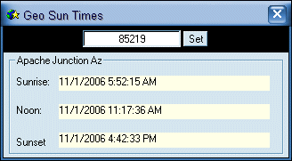



## Geo Sun Times 2

### Description

Geo Sun Times allows you to get your sunrise and sunset times each day by using your zip code to look up your geographical location in a database. The database file its self is to large to post here at PSC so you can download it from my website

here: http://www.tas-independent-programming.com/cgi-bin/download.pl?file=zipcodes-csv-10-Aug-2004.zip

This is an extended front end to compliment ahmed elsheshtawy's submission at http://www.Planet-Source-Code.com/vb/scripts/ShowCode.asp?txtCodeId=65314&amp;lngWId=1 .
 
### More Info
 

             |
---                |---
**Submitted On**   |2008-05-26 23:51:32
**By**             |[Thomas Swift](https://github.com/Planet-Source-Code/PSCIndex/blob/master/ByAuthor/thomas-swift.md)
**Level**          |Intermediate
**User Rating**    |5.0 (10 globes from 2 users)
**Compatibility**  |VB 6\.0
**Category**       |[Databases/ Data Access/ DAO/ ADO](https://github.com/Planet-Source-Code/PSCIndex/blob/master/ByCategory/databases-data-access-dao-ado__1-6.md)
**World**          |[Visual Basic](https://github.com/Planet-Source-Code/PSCIndex/blob/master/ByWorld/visual-basic.md)
**Archive File**   |[Geo\_Sun\_Ti2114045272008\.zip](https://github.com/Planet-Source-Code/thomas-swift-geo-sun-times-2__1-66949/archive/master.zip)

